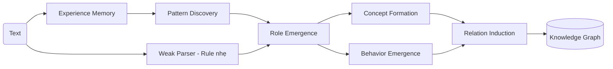

# llm-tiengviet
## Giới thiệu mô hình
Mô hình này không tiếp cận ngôn ngữ theo cách truyền thống (chỉ sinh câu),
mà đi theo hướng:
**Hiểu văn bản = Tách cấu trúc → Trích khái niệm → Nối quan hệ → Tạo tri thức**

Thay vì coi văn bản là chuỗi chữ, mô hình coi văn bản là:
một hệ thống gồm:
- thành phần ý nghĩa (nói về cái gì)
- hành vi ngôn ngữ (đang làm gì với câu)
- khái niệm (điều đang được nói tới)
- quan hệ (các khái niệm liên kết với nhau ra sao)
##### 📌 Quy trình hoạt động:

- Mô hình đang ở mức logic phục vụ cho Knowledge Graph
- 
#### So sánh với KG Engine truyền thống
| Tiêu chí             | Mô hình này (Experience-based) | KG Engine truyền thống |
| -------------------- | ------------------------------ | ---------------------- |
| Triết lý             | Từ trải nghiệm → tri thức      | Từ schema → tri thức   |
| Điểm xuất phát       | Text tự nhiên                  | Ontology / database    |
| Cách hiểu            | Pattern + ngữ cảnh             | Mapping cố định        |
| Tạo concept          | Emergent (tự hình thành)       | Định nghĩa trước       |
| Tạo relation         | Induction từ pattern           | Rule + schema          |
| Mức độ tự động       | ✔ Cao                          | ❌ Thấp                 |
| Phụ thuộc con người  | ✔ Ít                           | ❌ Nhiều                |
| Khả năng học         | ✔ Có (tích lũy)                | ❌ Gần như không        |
| Độ chính xác ban đầu | ⚠️ Thấp                        | ✔ Cao                  |
| Độ thích nghi        | ✔ Rất cao                      | ❌ Thấp                 |
| Giải thích           | ✔ Rõ                           | ✔ Rõ                   |


| Ưu/nhược           | Mô hình của tôi          | KG Engine truyền thống        |
| ------------------- | ------------------------ | ----------------------------- |


#### Version:
v1: Knowledge Graph Engine kiểu mới: Mô hình đang ở mức logic phục vụ cho Knowledge Graph, chưa Query Engine, Reasoning, Learning, Hybrid

# 1. Kiến trúc tổng quát
## A. LỚP CẤU TRÚC LOGIC:
### Text → Input
```
- Văn bản tự nhiên (raw text)
- Không yêu cầu schema, không preprocessing nặng
- CNN không hiểu nếu dữ liệu ít
```
### Weak Parser (Rule nhẹ)
```
👉 Vai trò:
KHÔNG hiểu ngữ nghĩa
Chỉ chia câu thành các phần thô

Ví dụ:
[cnn] [không hiểu] [nếu dữ liệu ít]

👉 Đặc điểm:
Không cần danh sách verb đầy đủ
Không phụ thuộc lexicon cứng
Chỉ là “gợi ý cấu trúc ban đầu”
```
### Experience Memory
```
👉 Lưu toàn bộ trải nghiệm:

{
  "sentence": "cnn không hiểu nếu dữ liệu ít",
  "tokens": [...],
  "l1_guess": {...}
}

👉 Đây là “trí nhớ” của hệ
```

### Pattern Discovery

```
👉 Tìm cái lặp lại giữa nhiều câu

Ví dụ:

cnn hiểu dữ liệu lớn
cnn hiểu dữ liệu tốt

→ phát hiện:

X hiểu Y
```

### Role Emergence (cốt lõi)
```
Máy tự suy ra vai trò:
| Thành phần | Vai trò             |
| ---------- | ------------------- |
| cnn        | biến (subject-like) |
| hiểu       | trung tâm           |
| dữ liệu    | biến (object-like)  |
KHÔNG cần định nghĩa trước
```
 
### Concept Formation
```
👉 Từ pattern:

X là Y

→ Y xuất hiện nhiều → trở thành khái niệm

Ví dụ:

mô hình học sâu
hệ thống
thuật toán
```

### Behavior Emergence
```
Từ nhiều pattern:

X là Y
X hiểu Y
X dẫn đến Y

→ nhóm lại:

Pattern	Behavior
X là Y	định danh
X hiểu Y	nhận thức
X dẫn đến Y	nguyên nhân

👉 Behavior không định nghĩa trước – mà tự xuất hiện
```

### Relation Induction
```
Từ pattern → quan hệ
| Pattern       | Relation |
| ------------- | -------- |
| X là Y        | IS_A     |
| X dẫn đến Y   | CAUSES   |
| X ảnh hưởng Y | AFFECTS  |
```
### Knowledge Graph
```
Kết quả cuối:

cnn --[không hiểu]--> dữ liệu ít
```
 
||===> Knowledge Graph cơ bản

### Demo
```
emty
```


## B. Thành phần nâng cao: (optinal)

# 2. Chương trình
#### 📂Thư mục: 
```
/myapp/
│
├── kg/
│
│   ├── data/                     # dữ liệu tối thiểu
│   │   └── stopwords.txt
│
│   ├── parsers/                  # parser nhẹ
│   │   └── parser_l1_l2.py
│
│   ├── experience/               # 🔥 TRỌNG TÂM
│   │   ├── experience_store.py
│   │   ├── pattern_miner.py
│   │   ├── role_emergence.py
│   │   └── dynamic_lexicon.py
│
│   ├── concept/                  # L3
│   │   └── extractor.py
│
│   ├── relation/                 # L4
│   │   └── extractor.py
│
│   ├── graph/                    # graph
│   │   ├── graph_store.py
│   │   └── graph.json
│
│   ├── utils/
│   │   ├── path_utils.py
│   │   └── text_utils.py
│
│   ├── main.py                   # pipeline chính
│
└── README.md
```

#### Giai đoạn hiện tại:
v1
- Đang ở bước test python3 -m kg.parsers.parser_l1_l2 "Do dữ liệu chưa đủ nên mô hình khó học"
- Đang có data json l1, l2. Cần thêm dữ liệu từ để đạt được bách khoa trong tiếng việt.
- Mục tiêu Xây một hệ hiểu văn bản tiếng Việt. không dựa xác suất (LLM) mà dựa cấu trúc tri thức
- 
