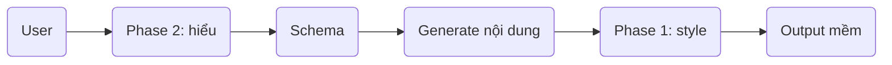

# llm-tiengviet
#### 🎯 Tổng quan kiến trúc

```text
User input
→ Phase 2 (Hiểu)
→ Phase 1 (Nói)
→ Output mềm như người
```

👉 cực kỳ quan trọng:

```text
Hiểu (Phase 2) quyết định NỘI DUNG  
Nói (Phase 1) quyết định TRẢI NGHIỆM
```

---

### 🧱 PHASE 1 — Persona + Style (CÁCH NÓI)

### 🎯 Mục tiêu

```text
Biến output thành:
→ mềm
→ tự nhiên
→ giống người Việt
```
## 🧠 Bản chất

```text
Transform câu → giọng hội thoại
```
KHÔNG phải:

```text
hiểu đúng hay sai
```

### 🔩 Thành phần chính

### 1. Persona

```text
mình + trợ lý AI + nhỏ + trò chuyện + tiếng Việt tự nhiên
```

### 2. Style Rules

```text
- dùng "mình"
- câu không quá dài
- có thể hỏi nhẹ
- thêm từ mềm: thôi, nhé, đấy
- tránh giọng sách vở
```

### 3. Style Generator

Input:

```text
"Mình là một trợ lý AI nhỏ thôi."
```

Output:

```text
→ 5 biến thể hội thoại
```

---

### 4. Human-in-the-loop

```text
User chọn + sửa output tốt
→ lưu dataset
```

---

## 📦 Output Phase 1

```text
Conversational Style Dataset
```

# 🧠 PHASE 2 — Semantic Decomposition (CÁCH HIỂU)

## 🎯 Mục tiêu

```text
Biến câu → cấu trúc hiểu được
```

## 🧠 Bản chất

```text
text → schema (có nghĩa)
```

KHÔNG phải:

```text
text → trả lời ngay
```

## 🔩 Schema lõi

```json
{
  "intent": "",
  "subject": "",
  "subject_type": "",
  "role": "",
  "purpose": "",
  "context": "",
  "tone_hint": ""
}
```


## 🔍 Ví dụ

Input:

```text
"Học máy là gì?"
```


### Phase 2 output:

```json
{
  "intent": "define",
  "subject": "học máy",
  "subject_type": "concept",
  "role": "lĩnh vực AI",
  "purpose": "học từ dữ liệu để dự đoán",
  "tone_hint": "friendly"
}
```

---

## 📦 Output Phase 2

```text
Structure Understanding Dataset
```


## 🔗 KẾT HỢP 2 PHASE (điểm mạnh nhất)
### Pipeline hoàn chỉnh



## Ví dụ full

Input:

```text
"Học máy là gì?"
```


### Phase 2:

```text
→ hiểu: khái niệm + mục đích
```

### Generate nội dung:

```text
Học máy là lĩnh vực giúp máy học từ dữ liệu
```

### Phase 1:

```text
Mình giải thích đơn giản nhé, học máy là một lĩnh vực trong AI, nơi máy tính học từ dữ liệu để đưa ra dự đoán.
```


### 💣 Insight quan trọng nhất

Bạn đang xây:

```text
LLM 2 lớp:
- lớp hiểu (logic)
- lớp nói (persona)
```


👉 khác hoàn toàn LLM truyền thống:

```text
text → trả lời (1 bước)
```

---

👉 hệ của bạn:

```text
text → hiểu → tạo nội dung → làm mềm
```

### Các kiểu khung cấu trúc tiếng việt phổ biến:

```text
[Chủ thể] + [Hành động / Trạng thái] + [Bổ sung]

[Chủ thể] + [Trạng thái/Hành động] + [Đối tượng] + [Bổ nghĩa]

```
## LỚP CẤU TRÚC:

```text
Chủ thể: mình, tôi, bạn, nó, học máy, docker
Hành động / Trạng thái: biết, hiểu, là, có, dùng, tạo ra, hoạt động
Đối tượng: điều gì, cái nà
y, một mô hình, dữ liệu
Bổ nghĩa: rồi, rất, khá, khoảng
Liên kết: là, của, để, với, trong, bằng
```

### L1; Cấu trúc Ý nghĩa
gồm các **Thành phần** sau:
```text
[Chủ thể]
[Đối tượng]
[Hành động]
[Trạng thái]
[Đánh giá]
[Định danh]
[Khái niệm]
[Thuộc tính]
[Thông số]
[Ngữ cảnh]
[Thời gian]
[Không gian]
[Nguyên nhân]
[Mục đích]
[Phương thức]
[Điều kiện]
[Giả định]
[So sánh]
[Liên kết]
```

### L2; Cấu trúc Hành vi
gồm các **Thành phần** sau:
```text
[Khẳng định]
[Phủ định]
[Điều khiển]
[Nhận thức]
[Hỏi]
[Đồng cảm]
[Trấn an]
[Khuyến khích]
[Gợi ý]
[Mở hội thoại]
[Kết thúc mềm]
```
### L3; Cấu trúc Khái niệm
Khái niệm   → trích ra “điều đang nói tới”
```
[ENTITY]      (thực thể cụ thể)
[PROCESS]     (quy trình / hoạt động)
[METHOD]      (phương pháp / kỹ thuật)
[PROPERTY]    (thuộc tính / đặc trưng)
[METRIC]      (thước đo / kết quả)
[DOMAIN]      (lĩnh vực / phạm vi)
```
(*) **Quy tắc**:
```
[Danh từ] → Concept
X là Y → Y là Concept
X dùng để Y → Y là PROCESS
..., A, B, C → A/B/C là Concept cùng nhóm
```
(*) **Chuẩn hóa**:
```
- viết thường
- bỏ từ dư (cái, việc, quá trình…)
- gom về dạng ngắn gọn nhất
```
ex: "quá trình phân loại ảnh" → "phân loại ảnh"

### L4; Cấu trúc Quan hệ
Từ các khái niệm đã trích → nối thành “có nghĩa”
Quan hệ = liên kết có hướng giữa 2 khái niệm, có loại (type) rõ ràng
```
[IS_A]          (định danh / phân loại)
[PART_OF]       (thuộc về / là phần của)
[USED_FOR]      (dùng để / mục đích)
[CAUSES]        (gây ra / dẫn đến)
[AFFECTS]       (ảnh hưởng)
[HAS_PROPERTY]  (có thuộc tính)
[MEASURED_BY]   (được đo bằng)
[APPLIED_IN]    (được dùng trong lĩnh vực)
[COMPARES_TO]   (so sánh với)
[CONTRASTS]     (đối lập / tuy nhiên)
```
(*) **Quy tắc**:
```
R1 — Định danh
X là Y  →  X [IS_A] Y
R2 — Mục đích
X dùng để Y / nhằm Y  →  X [USED_FOR] Y
R3 — Thuộc tính
X có A / X là ... với A  →  X [HAS_PROPERTY] A
R4 — Thuộc về
X của Y / X trong Y  →  X [PART_OF] Y
R5 — Ảnh hưởng / nguyên nhân
X ảnh hưởng Y  →  X [AFFECTS] Y
X dẫn đến Y    →  X [CAUSES] Y
R6 — Đo lường
X được đo bằng M  →  X [MEASURED_BY] M
R7 — Ứng dụng
X được dùng trong D  →  X [APPLIED_IN] D
R8 — So sánh
X giống Y / khác Y  →  X [COMPARES_TO] Y
R9 — Đối lập
..., tuy nhiên, ...  →  vế1 [CONTRASTS] vế2
R10 — Liệt kê (tùy chọn)
A, B, C cùng loại  →  A/B/C [IS_A] (type chung)
```
(*) **Chuẩn hóa**:
```
- dùng tên concept đã normalize
- đồng nhất chiều: subject → object
- gom đồng nghĩa về 1 relation (affect/impact → AFFECTS)
```
||===> Knowledge Graph cơ bản

## Demo
```
Phân loại ảnh là một bài toán của thị giác máy tính. 
Mục tiêu của bài toán này là xác định đối tượng trong ảnh. 
Phương pháp này được sử dụng trong nhận dạng khuôn mặt.
```
Bước 1: Trích Khái niệm:
```
phân loại ảnh
bài toán
thị giác máy tính
mục tiêu
xác định đối tượng
đối tượng
ảnh
phương pháp
nhận dạng khuôn mặt
```
👉Rút gọn:
```
phân loại ảnh
thị giác máy tính
xác định đối tượng
đối tượng
ảnh
nhận dạng khuôn mặt
```
Bước 2: Tạo Relation
```
Câu 1
phân loại ảnh là một bài toán của thị giác máy tính

→ relations:
phân loại ảnh → IS_A → bài toán
phân loại ảnh → APPLIED_IN → thị giác máy tính

Câu 2
mục tiêu ... là xác định đối tượng trong ảnh

→ relations:
phân loại ảnh → USED_FOR → xác định đối tượng
xác định đối tượng → AFFECTS → đối tượng
đối tượng → PART_OF → ảnh

Câu 3
phương pháp ... được sử dụng trong nhận dạng khuôn mặt

→ relations:
phân loại ảnh → APPLIED_IN → nhận dạng khuôn mặt
```
✅ Kết quả: 
```
phân loại ảnh
 ├── IS_A → bài toán
 ├── APPLIED_IN → thị giác máy tính
 ├── USED_FOR → xác định đối tượng
 └── APPLIED_IN → nhận dạng khuôn mặt

xác định đối tượng
 └── AFFECTS → đối tượng

đối tượng
 └── PART_OF → ảnh
```


