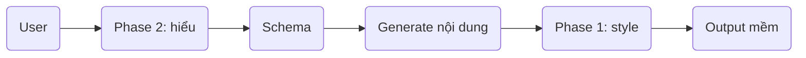

# llm-tiengviet
#### 🎯 Tổng quan kiến trúc

```text
User input
→ Phase 2 (Hiểu)
→ Phase 1 (Nói)
→ Output mềm như người
```

👉 cực kỳ quan trọng:

```text
Hiểu (Phase 2) quyết định NỘI DUNG  
Nói (Phase 1) quyết định TRẢI NGHIỆM
```

---

### 🧱 PHASE 1 — Persona + Style (CÁCH NÓI)

### 🎯 Mục tiêu

```text
Biến output thành:
→ mềm
→ tự nhiên
→ giống người Việt
```
## 🧠 Bản chất

```text
Transform câu → giọng hội thoại
```
KHÔNG phải:

```text
hiểu đúng hay sai
```

### 🔩 Thành phần chính

### 1. Persona

```text
mình + trợ lý AI + nhỏ + trò chuyện + tiếng Việt tự nhiên
```

### 2. Style Rules

```text
- dùng "mình"
- câu không quá dài
- có thể hỏi nhẹ
- thêm từ mềm: thôi, nhé, đấy
- tránh giọng sách vở
```

### 3. Style Generator

Input:

```text
"Mình là một trợ lý AI nhỏ thôi."
```

Output:

```text
→ 5 biến thể hội thoại
```

---

### 4. Human-in-the-loop

```text
User chọn + sửa output tốt
→ lưu dataset
```

---

## 📦 Output Phase 1

```text
Conversational Style Dataset
```

# 🧠 PHASE 2 — Semantic Decomposition (CÁCH HIỂU)

## 🎯 Mục tiêu

```text
Biến câu → cấu trúc hiểu được
```

## 🧠 Bản chất

```text
text → schema (có nghĩa)
```

KHÔNG phải:

```text
text → trả lời ngay
```

## 🔩 Schema lõi

```json
{
  "intent": "",
  "subject": "",
  "subject_type": "",
  "role": "",
  "purpose": "",
  "context": "",
  "tone_hint": ""
}
```


## 🔍 Ví dụ

Input:

```text
"Học máy là gì?"
```


### Phase 2 output:

```json
{
  "intent": "define",
  "subject": "học máy",
  "subject_type": "concept",
  "role": "lĩnh vực AI",
  "purpose": "học từ dữ liệu để dự đoán",
  "tone_hint": "friendly"
}
```

---

## 📦 Output Phase 2

```text
Structure Understanding Dataset
```


## 🔗 KẾT HỢP 2 PHASE (điểm mạnh nhất)
### Pipeline hoàn chỉnh



## Ví dụ full

Input:

```text
"Học máy là gì?"
```


### Phase 2:

```text
→ hiểu: khái niệm + mục đích
```

### Generate nội dung:

```text
Học máy là lĩnh vực giúp máy học từ dữ liệu
```

### Phase 1:

```text
Mình giải thích đơn giản nhé, học máy là một lĩnh vực trong AI, nơi máy tính học từ dữ liệu để đưa ra dự đoán.
```


### 💣 Insight quan trọng nhất

Bạn đang xây:

```text
LLM 2 lớp:
- lớp hiểu (logic)
- lớp nói (persona)
```


👉 khác hoàn toàn LLM truyền thống:

```text
text → trả lời (1 bước)
```

---

👉 hệ của bạn:

```text
text → hiểu → tạo nội dung → làm mềm
```

### Các kiểu khung cấu trúc tiếng việt phổ biến:

```text
[Chủ thể] + [Hành động / Trạng thái] + [Bổ sung]

[Chủ thể] + [Trạng thái/Hành động] + [Đối tượng] + [Bổ nghĩa]

```
### LỚP CẤU TRÚC:

```text
Chủ thể: mình, tôi, bạn, nó, học máy, docker
Hành động / Trạng thái: biết, hiểu, là, có, dùng, tạo ra, hoạt động
Đối tượng: điều gì, cái nà
y, một mô hình, dữ liệu
Bổ nghĩa: rồi, rất, khá, khoảng
Liên kết: là, của, để, với, trong, bằng
```

### L1; Cấu trúc Ý nghĩa
gồm các **Thành phần** sau:
```text
[Chủ thể]
[Đối tượng]
[Hành động]
[Trạng thái]
[Đánh giá]
[Định danh]
[Khái niệm]
[Thuộc tính]
[Thông số]
[Ngữ cảnh]
[Thời gian]
[Không gian]
[Nguyên nhân]
[Mục đích]
[Phương thức]
[Điều kiện]
[Giả định]
[So sánh]
[Liên kết]
```

### L2; Cấu trúc Hành vi
```text
[Khẳng định]
[Phủ định]
[Điều khiển]
[Nhận thức]
[Hỏi]
[Đồng cảm]
[Trấn an]
[Khuyến khích]
[Gợi ý]
[Mở hội thoại]
[Kết thúc mềm]
```

### L3; Cấu trúc Khái niệm

### L4; Cấu trúc Quan hệ


 


