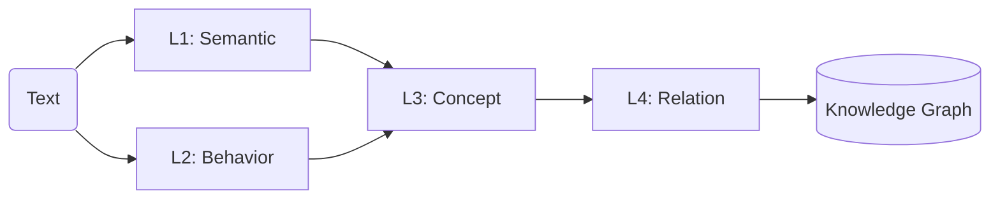

# llm-tiengviet
## Giới thiệu mô hình
Mô hình này không tiếp cận ngôn ngữ theo cách truyền thống (chỉ sinh câu),
mà đi theo hướng:
**Hiểu văn bản = Tách cấu trúc → Trích khái niệm → Nối quan hệ → Tạo tri thức**

Thay vì coi văn bản là chuỗi chữ, mô hình coi văn bản là:
một hệ thống gồm:
- thành phần ý nghĩa (nói về cái gì)
- hành vi ngôn ngữ (đang làm gì với câu)
- khái niệm (điều đang được nói tới)
- quan hệ (các khái niệm liên kết với nhau ra sao)
##### 📌 Quy trình hoạt động:

- Mô hình đang ở mức logic phục vụ cho Knowledge Graph
- 
#### So sánh với LLM 
| Tiêu chí            | Mô hình của tôi          | KG Engine truyền thống        |
| ------------------- | ------------------------ | ----------------------------- |
| Triết lý            | Từ ngôn ngữ → tri thức   | Từ dữ liệu → tri thức         |
| Điểm xuất phát      | Text (tự nhiên)          | Database / schema / ontology  |
| Mức độ tự động      | ✔ Cao (tự trích)         | ❌ Thấp (cần cấu hình)         |
| Phụ thuộc con người | ✔  Ít                     | ❌ Nhiều (define schema trước) |
| Cách tạo concept    | Tự động từ text          | Định nghĩa trước              |
| Cách tạo relation   | Rule + text              | Schema + mapping              |
| Linh hoạt ngôn ngữ  | ✔ Rất cao                | ❌ Hạn chế                     |
| Độ chính xác        | ⚠️ Phụ thuộc rule        | ✔ Cao (vì chuẩn hoá trước)    |
| Giải thích          | ✔ Rõ ràng                | ✔ Rõ ràng                     |
| Khả năng mở rộng    | ✔ Tự nhiên theo text     | ⚠️ Phải thiết kế schema       |
| Tính học            | ✔ Có thể học từ feedback | ❌ Ít (truyền thống)           |
| Tài nguyên          | ✔ Nhẹ                    | ⚠️ Trung bình                 |

| Ưu/nhược           | Mô hình của tôi          | KG Engine truyền thống        |
| ------------------- | ------------------------ | ----------------------------- |
| Ưu           | đọc text trực tiếp, không cần schema trước,linh hoạt, dễ mở rộng AI   | chính xác, chuẩn hoá tốt, ổn định production      |
| nhược           | dễ sai nếu rule chưa tốt,cần normalize mạnh   | khó dùng với text tự nhiên, cần define schema trước, không “hiểu” ngôn ngữ      |


#### Version:
v1: Knowledge Graph Engine kiểu mới: Mô hình đang ở mức logic phục vụ cho Knowledge Graph, chưa Query Engine, Reasoning, Learning, Hybrid

# 1. Kiến trúc tổng quát
## A. LỚP CẤU TRÚC LOGIC:

```text
Chủ thể: mình, tôi, bạn, nó, học máy, docker
Hành động / Trạng thái: biết, hiểu, là, có, dùng, tạo ra, hoạt động
Đối tượng: điều gì, cái nà
y, một mô hình, dữ liệu
Bổ nghĩa: rồi, rất, khá, khoảng
Liên kết: là, của, để, với, trong, bằng
```

### L1; Cấu trúc Ý nghĩa
gồm các **Thành phần** sau:
```text
  "thuc_the": null,
  "hanh_dong": null,
  [Đối tượng]  thứ mà hành động đang tác động vào, là “đích của hành động”
  "thuoc_tinh": [],
  "boi_canh": null,
  "pham_vi": null
```

### L2; Cấu trúc Hành vi
gồm các **Thành phần** sau:
```text
[Định danh]   (X là Y)
[Mô tả]       (nêu đặc điểm)
[Giải thích]  (có quan hệ logic)
[So sánh]     (hơn/kém/khác)
[Khẳng định]  (phát biểu sự thật)
```
### L3; Cấu trúc Khái niệm
Khái niệm   → trích ra “điều đang nói tới”
```
[ENTITY]      (thực thể cụ thể)
[PROCESS]     (quy trình / hoạt động)
[METHOD]      (phương pháp / kỹ thuật)
[PROPERTY]    (thuộc tính / đặc trưng)
[METRIC]      (thước đo / kết quả)
[DOMAIN]      (lĩnh vực / phạm vi)
```
(*) **Quy tắc**:
```
[Danh từ] → Concept
X là Y → Y là Concept
X dùng để Y → Y là PROCESS
..., A, B, C → A/B/C là Concept cùng nhóm
```
(*) **Chuẩn hóa**:
```
- viết thường
- bỏ từ dư (cái, việc, quá trình…)
- gom về dạng ngắn gọn nhất
```
ex: "quá trình phân loại ảnh" → "phân loại ảnh"

### L4; Cấu trúc Quan hệ
Từ các khái niệm đã trích → nối thành “có nghĩa”
Quan hệ = liên kết có hướng giữa 2 khái niệm, có loại (type) rõ ràng
```
[IS_A]          (định danh / phân loại)
[PART_OF]       (thuộc về / là phần của)
[USED_FOR]      (dùng để / mục đích)
[CAUSES]        (gây ra / dẫn đến)
[AFFECTS]       (ảnh hưởng)
[HAS_PROPERTY]  (có thuộc tính)
[MEASURED_BY]   (được đo bằng)
[APPLIED_IN]    (được dùng trong lĩnh vực)
[COMPARES_TO]   (so sánh với)
[CONTRASTS]     (đối lập / tuy nhiên)
```
(*) **Quy tắc**:
```
R1 — Định danh
X là Y  →  X [IS_A] Y
R2 — Mục đích
X dùng để Y / nhằm Y  →  X [USED_FOR] Y
R3 — Thuộc tính
X có A / X là ... với A  →  X [HAS_PROPERTY] A
R4 — Thuộc về
X của Y / X trong Y  →  X [PART_OF] Y
R5 — Ảnh hưởng / nguyên nhân
X ảnh hưởng Y  →  X [AFFECTS] Y
X dẫn đến Y    →  X [CAUSES] Y
R6 — Đo lường
X được đo bằng M  →  X [MEASURED_BY] M
R7 — Ứng dụng
X được dùng trong D  →  X [APPLIED_IN] D
R8 — So sánh
X giống Y / khác Y  →  X [COMPARES_TO] Y
R9 — Đối lập
..., tuy nhiên, ...  →  vế1 [CONTRASTS] vế2
R10 — Liệt kê (tùy chọn)
A, B, C cùng loại  →  A/B/C [IS_A] (type chung)
```
(*) **Chuẩn hóa**:
```
- dùng tên concept đã normalize
- đồng nhất chiều: subject → object
- gom đồng nghĩa về 1 relation (affect/impact → AFFECTS)
```
||===> Knowledge Graph cơ bản

### Demo
```
Phân loại ảnh là một bài toán của thị giác máy tính. 
Mục tiêu của bài toán này là xác định đối tượng trong ảnh. 
Phương pháp này được sử dụng trong nhận dạng khuôn mặt.
```
Bước 1: Trích Khái niệm:
```
phân loại ảnh
bài toán
thị giác máy tính
mục tiêu
xác định đối tượng
đối tượng
ảnh
phương pháp
nhận dạng khuôn mặt
```
👉Rút gọn:
```
phân loại ảnh
thị giác máy tính
xác định đối tượng
đối tượng
ảnh
nhận dạng khuôn mặt
```
Bước 2: Tạo Quan hệ
```
Câu 1
phân loại ảnh là một bài toán của thị giác máy tính

→ relations:
phân loại ảnh → IS_A → bài toán
phân loại ảnh → APPLIED_IN → thị giác máy tính

Câu 2
mục tiêu ... là xác định đối tượng trong ảnh

→ relations:
phân loại ảnh → USED_FOR → xác định đối tượng
xác định đối tượng → AFFECTS → đối tượng
đối tượng → PART_OF → ảnh

Câu 3
phương pháp ... được sử dụng trong nhận dạng khuôn mặt

→ relations:
phân loại ảnh → APPLIED_IN → nhận dạng khuôn mặt
```
✅ Kết quả: 
```
phân loại ảnh
 ├── IS_A → bài toán
 ├── APPLIED_IN → thị giác máy tính
 ├── USED_FOR → xác định đối tượng
 └── APPLIED_IN → nhận dạng khuôn mặt

xác định đối tượng
 └── AFFECTS → đối tượng

đối tượng
 └── PART_OF → ảnh
```
|=> để dựng Graph Engine 

## B. Thành phần nâng cao:
| Thành phần | KG truyền thống | Mô hình của tôi      |
| ---------- | --------------- | -------------------- |
| Graph      | Schema cố định  | Graph động từ text   |
| Query      | Cypher / SPARQL | pattern-based        |
| Reasoning  | logic formal    | rule đơn giản + path |
| Input      | structured data | natural language     |
| Mở rộng    | khó             | rất dễ               |

### Graph Engine

### Query Engine

### Reasoning

### Learning

# 2. Chương trình
#### 📂Thư mục: 
```
/anhtu/myapp/
│
├── docker-compose.yml
│
├── nginx/
│   └── nginx.conf
│
├── myweb/
│   └── index.html
│
├── nodered/
│
├── kg/                        # 🔥 CORE AI SYSTEM
│
│   ├── data/                 # dữ liệu tĩnh
│   │   ├── semantic_lexicon.json
│   │   ├── behavior_lexicon.json
│   │   └── stopwords.txt
│   │
│   ├── schemas/              # schema JSON chuẩn
│   │   ├── l1_schema.json
│   │   ├── l2_schema.json
│   │   ├── concept_schema.json
│   │   └── relation_schema.json
│   │
│   ├── parsers/              # 🔹 L1 + L2
│   │   ├── parser_l1_l2.py
│   │   ├── parser_l3.py
│   │   └── __init__.py
│   │
│   ├── concept/              # 🔹 L3
│   │   ├── extractor.py
│   │   └── normalizer.py
│   │
│   ├── relation/             # 🔹 L4
│   │   ├── extractor.py
│   │   └── rules.py
│   │
│   ├── graph/                # 🔥 GRAPH ENGINE
│   │   ├── graph_store.py
│   │   └── graph.json
│   │
│   ├── query/                # 🔥 QUERY ENGINE (bước tiếp)
│   │   └── query_engine.py
│   │
│   ├── reasoning/            # 🔥 REASONING (sau này)
│   │   └── rules.py
│   │
│   ├── api/                  # expose ra ngoài
│   │   └── app.py
│   │
│   └── main.py               # chạy pipeline end-to-end
│   ├── utils/
│      ├── __init__.py
│      └── path_utils.py
│      └── text_utils.py
│
├── llm/                      # (optional)
│   ├── llama-cli
│   └── model.gguf
│
└── README.md
```
