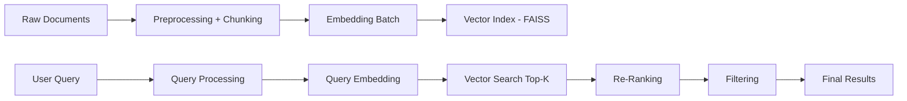

Dưới đây là **pipeline semantic search hoàn chỉnh (production-ready, gọn nhưng đúng chuẩn)**. Thiết kế này tối ưu cho **document / knowledge search**, dễ scale, dễ gắn vào API.

---

# 🧠 1. Pipeline tổng thể



---

# ⚙️ 2. Kiến trúc thư mục

```bash
kg/
├── embedding/
│   └── embedding_engine.py
├── preprocess/
│   └── text_cleaner.py
├── chunking/
│   └── chunker.py
├── vectorstore/
│   └── faiss_store.py
├── retriever/
│   └── retriever.py
├── reranker/
│   └── reranker.py
├── pipeline/
│   └── search_pipeline.py
└── main.py
```

---

# 🧩 3. Các layer (code cốt lõi)

---

## 🔹 (1) Preprocessing

```python
# preprocess/text_cleaner.py

import re

def clean_text(text: str) -> str:
    text = text.lower()
    text = re.sub(r"[^\w\s]", " ", text)
    text = re.sub(r"\s+", " ", text).strip()
    return text
```

---

## 🔹 (2) Chunking

```python
# chunking/chunker.py

def chunk_text(text: str, max_len=200):
    words = text.split()
    chunks = []

    for i in range(0, len(words), max_len):
        chunk = " ".join(words[i:i+max_len])
        chunks.append(chunk)

    return chunks
```

---

## 🔹 (3) Embedding (giữ từ hệ cũ)

```python
# embedding/embedding_engine.py

from sentence_transformers import SentenceTransformer

MODEL_NAME = "bkai-foundation-models/vietnamese-bi-encoder"
_model = None

def get_model():
    global _model
    if _model is None:
        _model = SentenceTransformer(MODEL_NAME)
    return _model

def encode_batch(texts):
    model = get_model()
    return model.encode(texts, normalize_embeddings=True)
```

---

## 🔹 (4) Vector Store (FAISS)

```python
# vectorstore/faiss_store.py

import faiss
import numpy as np


class FaissStore:
    def __init__(self, dim=768):
        self.index = faiss.IndexFlatIP(dim)
        self.texts = []

    def add(self, vectors, texts):
        vecs = np.array(vectors).astype("float32")
        self.index.add(vecs)
        self.texts.extend(texts)

    def search(self, query_vec, top_k=10):
        q = np.array([query_vec]).astype("float32")
        scores, ids = self.index.search(q, top_k)

        results = []
        for i, idx in enumerate(ids[0]):
            if idx < len(self.texts):
                results.append({
                    "text": self.texts[idx],
                    "score": float(scores[0][i])
                })

        return results
```

---

## 🔹 (5) Retriever

```python
# retriever/retriever.py

from kg.embedding.embedding_engine import encode_batch

def retrieve(query, store, top_k=20):
    vec = encode_batch([query])[0]
    return store.search(vec, top_k)
```

---

## 🔹 (6) Re-ranker

```python
# reranker/reranker.py

def rerank(query, candidates):
    q_words = set(query.split())
    results = []

    for item in candidates:
        score = item["score"]

        overlap = sum(1 for w in q_words if w in item["text"])
        score += overlap * 0.02

        results.append({
            "text": item["text"],
            "score": score
        })

    return sorted(results, key=lambda x: x["score"], reverse=True)
```

---

## 🔹 (7) Filter

```python
# pipeline/filter.py

def filter_results(results, threshold=0.5):
    return [r for r in results if r["score"] >= threshold]
```

---

## 🔹 (8) Pipeline chính

```python
# pipeline/search_pipeline.py

from kg.retriever.retriever import retrieve
from kg.reranker.reranker import rerank
from kg.pipeline.filter import filter_results


def search(query, store):
    candidates = retrieve(query, store, top_k=20)

    reranked = rerank(query, candidates)

    filtered = filter_results(reranked)

    return filtered[:5]
```

---

# 🚀 4. Index dữ liệu (quan trọng)

```python
# main.py (index phase)

from kg.preprocess.text_cleaner import clean_text
from kg.chunking.chunker import chunk_text
from kg.embedding.embedding_engine import encode_batch
from kg.vectorstore.faiss_store import FaissStore

store = FaissStore()

documents = [
    "AI xử lý dữ liệu lớn trong doanh nghiệp",
    "Machine learning áp dụng vào big data",
    "Hệ thống phân tích dữ liệu quy mô lớn"
]

all_chunks = []

for doc in documents:
    clean = clean_text(doc)
    chunks = chunk_text(clean)
    all_chunks.extend(chunks)

vectors = encode_batch(all_chunks)

store.add(vectors, all_chunks)
```

---

# 🔍 5. Query

```python
# main.py (search phase)

from kg.pipeline.search_pipeline import search

query = "xử lý dữ liệu lớn"
results = search(query, store)

for r in results:
    print(r)
```

---

# ⚠️ 6. Những thứ BẮT BUỘC nếu chạy thật

## 🔥 Persist index

```python
faiss.write_index(store.index, "index.faiss")
```

Load lại:

```python
store.index = faiss.read_index("index.faiss")
```

---

## 🔥 Batch insert (KHÔNG loop từng câu)

```python
encode_batch(list_texts)
```

---

## 🔥 Deduplicate trước khi add

---

## 🔥 Metadata (rất quan trọng)

Sửa:

```python
self.texts = []
```

→

```python
self.data = [
  {
    "text": "...",
    "doc_id": "...",
    "source": "..."
  }
]
```

---

# 🧠 7. Version production chuẩn hơn (nâng cấp)

## Level 2:

* BM25 + Vector (Hybrid search)
* Redis cache query
* Pagination

## Level 3:

* Qdrant / Weaviate
* Cross-encoder reranker
* Multi-language

---

# 🔥 8. Tóm tắt

Pipeline chuẩn:

```text
Document → Clean → Chunk → Embed → FAISS index

Query → Embed → Top-K → Re-rank → Filter → Result
```

---

# 🎯 Kết luận

Đây là phiên bản:

* ✔ Đúng chuẩn industry
* ✔ Scale được
* ✔ Thay thế hoàn toàn pipeline cũ
* ✔ Có thể gắn API ngay

---

Nếu cần bước tiếp theo:

* build API (FastAPI)
* gắn vào Nginx + Docker
* hoặc nối vào chatbot (RAG)

→ chỉ cần nói rõ use-case, sẽ thiết kế tiếp đúng hướng.
