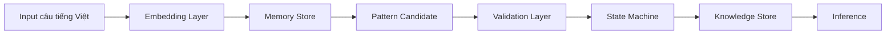

Dưới đây là **pipeline thực hành hoàn chỉnh** mình khuyên dùng lúc này: nhẹ, hiệu quả, không tự build lại mọi thứ, nhưng vẫn giữ lõi riêng của bạn.

Mình chọn model chính:

```text
bkai-foundation-models/vietnamese-bi-encoder
```

Lý do: là sentence-transformers cho tiếng Việt, output vector 768 chiều, phù hợp semantic search / clustering, nhẹ hơn các model BGE-M3 0.6B. ([Hugging Face][1])
Nếu máy bạn khỏe hơn, có thể đổi sang `AITeamVN/Vietnamese_Embedding`, model fine-tune từ BGE-M3 cho tiếng Việt, sequence length 2048, output 1024 chiều nhưng nặng hơn. ([Hugging Face][2])

---

# Pipeline thực hành



---

# 1. Cài thư viện

```bash
cd ~/myapp
python3 -m venv venv
source venv/bin/activate

pip install sentence-transformers numpy scikit-learn
```

---

# 2. Cấu trúc thư mục

```bash
kg/
├── main.py
├── data/
│   ├── train_cases.jsonl
│   └── eval_cases.jsonl
├── embedding/
│   ├── __init__.py
│   └── embedding_engine.py
├── memory/
│   ├── __init__.py
│   └── memory_store.py
├── validation/
│   ├── __init__.py
│   └── validation_gate.py
├── state/
│   ├── __init__.py
│   └── state_machine.py
├── knowledge/
│   ├── __init__.py
│   └── knowledge_store.py
└── utils/
    ├── __init__.py
    └── jsonl_utils.py
```

Tạo nhanh:

```bash
mkdir -p kg/{data,embedding,memory,validation,state,knowledge,utils}
touch kg/__init__.py
touch kg/{embedding,memory,validation,state,knowledge,utils}/__init__.py
```

---

# 3. `kg/embedding/embedding_engine.py`

```python
from sentence_transformers import SentenceTransformer
import numpy as np


MODEL_NAME = "bkai-foundation-models/vietnamese-bi-encoder"

_model = None


def get_model():
    global _model
    if _model is None:
        _model = SentenceTransformer(MODEL_NAME)
    return _model


def encode_text(text: str) -> list[float]:
    model = get_model()
    vec = model.encode(text, normalize_embeddings=True)
    return vec.tolist()


def cosine(a: list[float], b: list[float]) -> float:
    va = np.array(a)
    vb = np.array(b)
    return float(np.dot(va, vb))
```

---

# 4. `kg/utils/jsonl_utils.py`

```python
import json
from pathlib import Path


def read_jsonl(path: str):
    p = Path(path)
    if not p.exists():
        return []

    rows = []
    with open(p, "r", encoding="utf-8") as f:
        for line in f:
            line = line.strip()
            if line:
                rows.append(json.loads(line))
    return rows


def append_jsonl(path: str, item: dict):
    p = Path(path)
    p.parent.mkdir(parents=True, exist_ok=True)

    with open(p, "a", encoding="utf-8") as f:
        f.write(json.dumps(item, ensure_ascii=False) + "\n")
```

---

# 5. `kg/memory/memory_store.py`

```python
from pathlib import Path
from kg.utils.jsonl_utils import append_jsonl, read_jsonl
from kg.embedding.embedding_engine import encode_text


MEMORY_PATH = "kg/memory/memory.jsonl"


def add_memory(text: str, source: str = "manual"):
    item = {
        "text": text,
        "source": source,
        "vector": encode_text(text)
    }

    append_jsonl(MEMORY_PATH, item)
    return item


def load_memory():
    return read_jsonl(MEMORY_PATH)
```

---

# 6. `kg/validation/validation_gate.py`

```python
from kg.embedding.embedding_engine import cosine


def semantic_score(text: str, memory_item: dict, vector: list[float]) -> float:
    return cosine(vector, memory_item["vector"])


def validate_understanding(text: str, vector: list[float], memory: list[dict]):
    if not memory:
        return {
            "verdict": "BIET",
            "score": 0.0,
            "nearest": []
        }

    scored = []
    for item in memory:
        sim = semantic_score(text, item, vector)
        scored.append({
            "text": item["text"],
            "score": round(sim, 4)
        })

    scored = sorted(scored, key=lambda x: x["score"], reverse=True)
    top = scored[:5]
    best = top[0]["score"]

    if best >= 0.82:
        verdict = "HIEU"
    elif best >= 0.68:
        verdict = "THONG"
    else:
        verdict = "BIET"

    return {
        "verdict": verdict,
        "score": round(best, 4),
        "nearest": top
    }
```

---

# 7. `kg/state/state_machine.py`

```python
STATE_RANK = {
    "BIET": 1,
    "THONG": 2,
    "HIEU": 3,
    "THAU": 4
}


def choose_state(validation_result: dict):
    return validation_result["verdict"]
```

---

# 8. `kg/knowledge/knowledge_store.py`

```python
from kg.utils.jsonl_utils import append_jsonl, read_jsonl

KNOWLEDGE_PATH = "kg/knowledge/knowledge.jsonl"


def add_knowledge(text: str, state: str, score: float, evidence: list[dict]):
    item = {
        "text": text,
        "state": state,
        "score": score,
        "evidence": evidence
    }

    append_jsonl(KNOWLEDGE_PATH, item)
    return item


def load_knowledge():
    return read_jsonl(KNOWLEDGE_PATH)
```

---

# 9. `kg/main.py`

```python
import sys
import json

from kg.embedding.embedding_engine import encode_text
from kg.memory.memory_store import add_memory, load_memory
from kg.validation.validation_gate import validate_understanding
from kg.state.state_machine import choose_state
from kg.knowledge.knowledge_store import add_knowledge


def run(text: str):
    memory = load_memory()
    vector = encode_text(text)

    validation = validate_understanding(text, vector, memory)
    state = choose_state(validation)

    memory_item = add_memory(text)

    knowledge_item = None
    if state in ["HIEU", "THAU"]:
        knowledge_item = add_knowledge(
            text=text,
            state=state,
            score=validation["score"],
            evidence=validation["nearest"]
        )

    return {
        "input": text,
        "state": state,
        "validation": validation,
        "saved_memory": {
            "text": memory_item["text"],
            "vector_dim": len(memory_item["vector"])
        },
        "saved_knowledge": knowledge_item
    }


def main():
    if len(sys.argv) < 2:
        print('Usage: python3 -m kg.main "câu tiếng Việt"')
        return

    text = " ".join(sys.argv[1:])
    result = run(text)

    print(json.dumps(result, ensure_ascii=False, indent=2))


if __name__ == "__main__":
    main()
```

---

# 10. Test thực tế

Reset:

```bash
rm -f kg/memory/memory.jsonl
rm -f kg/knowledge/knowledge.jsonl
```

Nạp vài câu:

```bash
python3 -m kg.main "LLM hiểu dữ liệu lớn"
python3 -m kg.main "AI xử lý dữ liệu quy mô lớn"
python3 -m kg.main "Mô hình học từ dữ liệu lớn"
```

Test câu mới:

```bash
python3 -m kg.main "Hệ thống nắm bắt thông tin quy mô lớn"
```

Nếu nearest score cao, nó sẽ lên `THONG` hoặc `HIEU`.

---

# Ý nghĩa kết quả

Output không nói “tôi chắc chắn hiểu”. Nó nói:

```json
{
  "state": "HIEU",
  "score": 0.84,
  "nearest": [
    {
      "text": "AI xử lý dữ liệu quy mô lớn",
      "score": 0.86
    }
  ]
}
```

Tức là hệ hiểu theo kiểu:

```text
Câu mới gần nghĩa với những trải nghiệm đã học.
```

Đây là bước đầu đúng hơn rất nhiều so với tự chunk/rule.

---

# Tóm tắt

Pipeline này:

```text
Không tự build tokenizer
Không tự chunk
Không viết lexicon
Dùng model nhỏ làm semantic sensor
CLE giữ vai trò memory + validation + state + knowledge
```

Đây là bản thực hành tốt nhất để bạn bắt đầu lại sạch.

[1]: https://huggingface.co/bkai-foundation-models/vietnamese-bi-encoder?utm_source=chatgpt.com "bkai-foundation-models/vietnamese-bi-encoder"
[2]: https://huggingface.co/AITeamVN/Vietnamese_Embedding?utm_source=chatgpt.com "AITeamVN/Vietnamese_Embedding"
