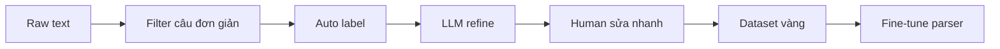

Dưới đây là **bộ nhãn tối thiểu (schema)** đủ để ông bắt đầu parse + suy luận cơ bản, và **quy trình tạo ~1000 câu “vàng” nhanh (semi-auto)** để huấn luyện/fine-tune.

---

# 🧠 1) Bộ nhãn tối thiểu cho tiếng Việt (MVP)

## 1.1. Nhãn cấp câu (Semantic Roles)

Chỉ cần 6 nhãn lõi:

```text
SUBJECT    (A)     — chủ thể
ACTION     (V)     — hành động / quan hệ
OBJECT     (B)     — đối tượng
ATTR       (Attr)  — thuộc tính (màu, trạng thái…)
TIME       (T)     — thời gian
LOC        (L)     — nơi chốn
```

### Ví dụ

```text
“Mèo đen đang ăn cá trong sân.”
→ SUBJECT: “mèo đen”
→ ACTION:  “đang ăn”
→ OBJECT:  “cá”
→ LOC:     “trong sân”
```

---

## 1.2. Chuẩn hoá quan hệ (Relation set)

Giữ **8 quan hệ chuẩn** (đủ cho giai đoạn đầu):

```text
IS_A       (là)
HAS        (có / sở hữu)
NEED       (cần / phải)
ACTION     (động từ chung)
CAUSE      (gây ra / dẫn đến)
USED_FOR   (dùng để)
PART_OF    (thuộc / là phần của)
STATE      (trạng thái)
```

### Mapping ví dụ

```text
“là”         → IS_A
“có”         → HAS
“cần”        → NEED
“ăn / chạy”  → ACTION
```

---

## 1.3. Nhãn cấu trúc logic (bắt buộc cho suy luận)

```text
NEGATION    (không)
CONDITION   (nếu… thì…)
COREF       (nó, họ…)
```

### Ví dụ

```text
“Nếu mèo đói thì nó cần ăn.”

→ CONDITION:
   IF:  (mèo, STATE, đói)
   THEN:(mèo, NEED, ăn)

→ COREF:
   “nó” = “mèo”
```

---

## 1.4. Format JSON chuẩn (dùng luôn)

```json
{
  "text": "Mèo đang ăn cá trong sân.",
  "roles": {
    "subject": "mèo",
    "action": "ăn",
    "object": "cá",
    "location": "trong sân"
  },
  "relation": {
    "type": "ACTION"
  },
  "logic": {
    "negation": false,
    "condition": null
  }
}
```

---

# ⚙️ 2) Tạo 1000 câu “vàng” nhanh (semi-auto)

## Mục tiêu

* 1000–3000 câu
* có nhãn SUBJECT/ACTION/OBJECT (+ optional)
* đủ để fine-tune parser nhỏ

---

## 2.1. Nguồn dữ liệu nhanh

* Wikipedia tiếng Việt (đoạn mô tả)
* báo (vnexpress, dantri)
* tài liệu học (PDF → text)

---

## 2.2. Bước 1: Tự sinh nhãn thô (auto label)

Dùng parser có sẵn:

* underthesea / VnCoreNLP / Stanza

### Code skeleton

```python
def auto_label(sentence):
    # giả lập đơn giản
    words = sentence.split()

    subject = words[0]
    action = words[1] if len(words) > 1 else ""
    obj = " ".join(words[2:]) if len(words) > 2 else ""

    return {
        "subject": subject,
        "action": action,
        "object": obj
    }
```

→ Đây là “nhãn thô”, chưa chính xác.

---

## 2.3. Bước 2: Lọc câu dễ (cực quan trọng)

Chỉ giữ câu dạng:

```text
A là B
A có B
A động từ B
```

Regex ví dụ:

```python
def is_simple_sentence(s):
    return any(x in s for x in [" là ", " có ", " ăn ", " dùng ", " cần "])
```

→ Giảm 10000 câu → còn ~2000 câu “dễ gán”

---

## 2.4. Bước 3: Sửa nhanh bằng người (human-in-the-loop)

Dùng file JSONL:

```json
{"text": "...", "subject": "...", "action": "...", "object": "..."}
```

Người sửa:

* mỗi câu 3–5 giây
* 1000 câu ≈ 1–2 giờ

---

## 2.5. Bước 4: Tăng tốc bằng LLM (semi-auto)

Dùng ChatGPT hoặc model local:

Prompt:

```text
Trích subject, action, object từ câu:
“Mèo đang ăn cá trong sân”

Trả về JSON:
{
  "subject": "",
  "action": "",
  "object": ""
}
```

→ Sau đó người chỉ cần **duyệt lại**

---

## 2.6. Bước 5: Tạo thêm dữ liệu bằng template (rất nhanh)

Template:

```text
{A} là {B}
{A} có {B}
{A} cần {B}
{A} dùng để {B}
```

Sinh tự động:

```python
entities = ["mèo", "chó", "người", "cây"]
objects = ["thức ăn", "nước", "lá", "chuột"]

data = []
for e in entities:
    for o in objects:
        data.append(f"{e} cần {o}")
```

→ thêm vài trăm câu “sạch 100%”

---

# 🚀 3) Pipeline hoàn chỉnh tạo dataset



---

# 🎯 4) Quy mô khởi động hợp lý

| Mức       | Số câu    | Mục tiêu         |
| --------- | --------- | ---------------- |
| MVP       | 300–500   | test pipeline    |
| Khởi động | 1000–1500 | train parser nhỏ |
| Tốt       | 3000+     | ổn định          |

---

# 🧠 5) Insight quan trọng

* Không cần 1 triệu câu
* Cần **1000 câu đúng, sạch, rõ cấu trúc**

```text
Chất lượng > số lượng
```

---

# 🎯 6) Kết luận

## Bộ nhãn tối thiểu:

```text
SUBJECT
ACTION
OBJECT
+ (ATTR, TIME, LOC)
+ (NEGATION, CONDITION, COREF)
+ relation chuẩn hoá
```

## Dataset:

```text
1000 câu
→ auto label
→ LLM hỗ trợ
→ người sửa nhanh
```

---

Nếu muốn bước tiếp:

có thể cung cấp:

* script tạo dataset tự động từ Wikipedia
* UI nhỏ để gán nhãn nhanh (web local)
* hoặc code fine-tune parser mini (LoRA) cho tiếng Việt

## B. Thư mục:
```
myapp/
└── kg/
    ├── main.py                  # entry chạy pipeline
    │
    ├── config/
    │   └── settings.py          # config chung (model, threshold...)
    │
    ├── data/
    │   ├── raw/                 # text gốc (paper, article)
    │   ├── processed/           # text đã xử lý
    │   └── dataset/             # dataset vàng (jsonl)
    │
    ├── preprocess/
    │   ├── cleaner.py           # làm sạch text
    │   └── splitter.py          # tách câu
    │
    ├── parser/
    │   ├── pos.py               # POS tagging (tạm đơn giản)
    │   ├── dependency.py        # (sau này gắn parser thật)
    │   └── semantic_roles.py    # SUBJECT/ACTION/OBJECT
    │
    ├── coref/
    │   └── resolver.py          # resolve “nó” → subject
    │
    ├── triple/
    │   └── extractor.py         # tạo (subject, relation, object)
    │
    ├── embedding/
    │   └── embedder.py          # sentence embedding
    │
    ├── clustering/
    │   └── clusterer.py         # gom nhóm câu
    │
    ├── graph/
    │   ├── builder.py           # xây graph tri thức
    │   └── tree.py              # xuất cây kiến thức
    │
    ├── evaluation/
    │   └── eval.py              # đánh giá sau này
    │
    ├── utils/
    │   └── io.py                # đọc/ghi file
    │
    └── tests/
        └── test_pipeline.py
```
